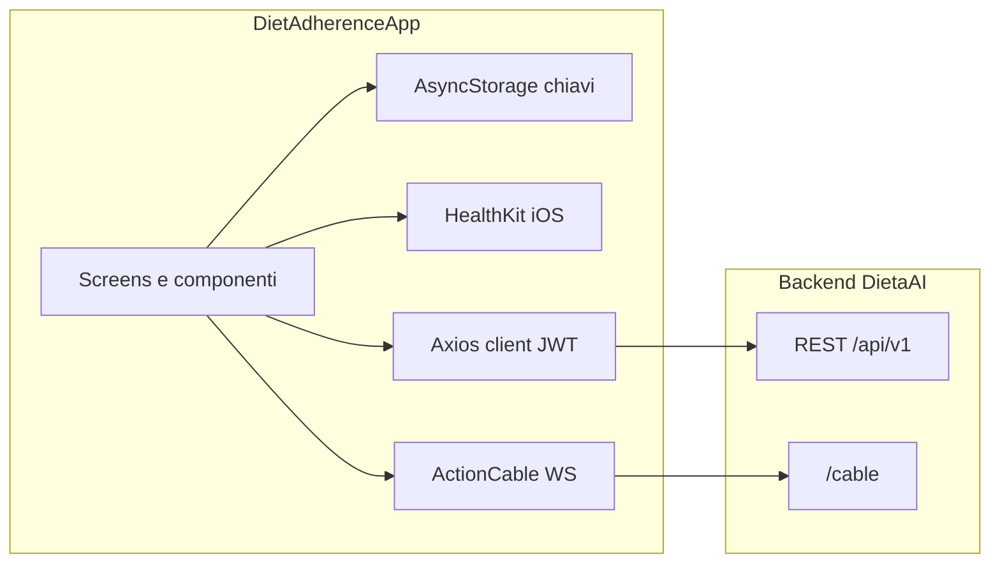

# Assessment struttura DietAdherenceApp e persistenza dati

## Cosa è questo progetto

Applicazione **React Native** (`[package.json](package.json)`) con navigazione drawer/stack (`[src/navigation/](src/navigation/)`), **TanStack Query** per cache richieste (`[App.tsx](App.tsx)`), **Axios** verso API REST (`[src/api/client.ts](src/api/client.ts)`) e **Action Cable** (WebSocket) per aggiornamenti chat in tempo reale (`[src/hooks/useChat.ts](src/hooks/useChat.ts)`, `[src/config/api.ts](src/config/api.ts)` — `CABLE_URL`).

**Non è presente** in questo repository alcun database relazionale (nessun SQLite, WatermelonDB, Realm, migrazioni SQL). Le “tabelle” in senso classico (schema DB) **non sono definite qui**: vivono sul **backend** servito da `[API_BASE](src/config/api.ts)` (es. Heroku `resta-ai-...`), tipicamente Rails + PostgreSQL o simile, ma **andrebbe verificato nel repo del backend**, non in questa app.

---

## Struttura cartelle (alto livello)

| Area                                 | Ruolo                                                                                                      |
| ------------------------------------ | ---------------------------------------------------------------------------------------------------------- |
| `[src/screens/](src/screens/)`       | Schermate (Home, Chat, Salute, Dieta, Profilo, Login/Register, onboarding, ecc.)                           |
| `[src/api/](src/api/)`               | Chiamate HTTP per dominio: auth, profilo, dashboard, dieta, chat, foto, pesi, ricette, onboarding, memorie |
| `[src/hooks/](src/hooks/)`           | Logica chat: storico, paginazione, cable, invio messaggi                                                   |
| `[src/context/](src/context/)`       | `AuthContext`, `ThemeContext`                                                                              |
| `[src/components/](src/components/)` | UI riutilizzabile + sottocartella `chat/` (messaggi, card, markdown)                                       |
| `[src/services/](src/services/)`     | Integrazione **Apple HealthKit** (`[appleHealth.ts](src/services/appleHealth.ts)`)                         |
| `[src/onboarding/](src/onboarding/)` | Flusso onboarding e storage flag completamento                                                             |
| `[src/types/](src/types/)`           | Tipi TypeScript condivisi (es. `[index.ts](src/types/index.ts)`, chat)                                     |
| `[__tests__/](__tests__/)`           | Test Jest                                                                                                  |

Architettura dati lato client (semplificata):

---

## Dove si “registrano” i dati (nell’app)

### 1. Backend remoto (persistenza principale)

Tutti i dati di prodotto (utente, piano dieta, messaggi chat lato server, pesi, foto, dashboard, ecc.) passano dall’API. Endpoint usati dal client (estrazione da `[src/api/](src/api/)`):

- **Auth**: `POST` login/register, `DELETE` logout — `[auth.ts](src/api/auth.ts)`
- **Profilo**: `GET`/`PATCH` `/profile` — `[profile.ts](src/api/profile.ts)`
- **Dashboard**: `GET` `/dashboard` — `[dashboard.ts](src/api/dashboard.ts)`
- **Piano dieta**: `GET` `/diet_plan`, `/diet_plans`; `POST` `/diet_plan`, `/diet_plan/scan`; `PATCH` reactivate; `DELETE` — `[dietPlan.ts](src/api/dietPlan.ts)`
- **Chat**: `POST` `/chat`; `GET` `/chat/history`; `POST` `/chat/reaction`, `/chat/confirm`; `GET` `/chat/briefing` — `[chat.ts](src/api/chat.ts)`
- **Onboarding**: `GET`/`POST` `/onboarding` — `[onboarding.ts](src/api/onboarding.ts)`
- **Memorie**: `GET` `/memories` — `[memories.ts](src/api/memories.ts)`
- **Foto**: `GET` `/photos`, `DELETE` `/photos/:id` — `[photos.ts](src/api/photos.ts)`
- **Pesi**: `GET` `/weights`, `DELETE` `/weights/:id` — `[weights.ts](src/api/weights.ts)`
- **Ricette**: `GET` `/recipes/alternatives` — `[recipes.ts](src/api/recipes.ts)`
- **Health check**: `GET` `/health` — `[health.ts](src/api/health.ts)`

Questi endpoint corrispondono, lato server, a **modelli/tabelle** (es. `users`, `diet_plans`, `messages`, …) che **non sono visibili in questo repo**.

### 2. AsyncStorage (solo chiavi, non tabelle)

Persistenza **key-value** locale:

| Chiave / prefisso                                           | Uso                                                                                   |
| ----------------------------------------------------------- | ------------------------------------------------------------------------------------- |
| `dietaai_jwt`                                               | Token JWT (`[authStorage.ts](src/api/authStorage.ts)`)                                |
| `dietaai_onboarding_done_v1:` + userKey                     | Onboarding completato (`[onboardingStorage.ts](src/onboarding/onboardingStorage.ts)`) |
| `theme_preference`                                          | Tema (`[themePreference.ts](src/theme/themePreference.ts)`)                           |
| `chat_keyboard_auto_close`                                  | Preferenza tastiera chat (`[keyboardPreference.ts](src/chat/keyboardPreference.ts)`)  |
| `apple_health_linked`, `apple_health_read_auth_prompted_v2` | Stato collegamento Salute (`[appleHealth.ts](src/services/appleHealth.ts)`)           |

### 3. Apple Health (iOS)

Dati letti dal **sistema** (HealthKit), non da tabelle dell’app; eventualmente inviati al backend come `health_data` con i messaggi chat.

---

## Punti di forza della struttura

- Separazione netta **API / schermate / navigazione / servizi nativi**.
- **Client Axios centralizzato** con interceptor JWT e gestione 401/503 (`[client.ts](src/api/client.ts)`).
- Tipi TypeScript per risposte normalizzate dove serve (es. dashboard, profile).

## Limiti / attenzioni

- **Nessuna cache offline strutturata** dei dati di dominio: senza rete le schermate che dipendono dall’API non hanno uno store locale tipo SQLite.
- **Schema DB**: per elenco preciso di tabelle e colonne serve il **codice del backend** (migrazioni Rails, Prisma, ecc.), non presente qui.

---

## Risposta diretta alla domanda sulle “tabelle”

In **questo progetto** non ci sono tabelle SQL: c’è **AsyncStorage** (coppie chiave-valore) e dati su **HealthKit**. Le **tabelle** dove si registrano peso, piano, chat, utenti, ecc. sono sul **server** dietro `/api/v1`; vanno documentate dal repository del backend.