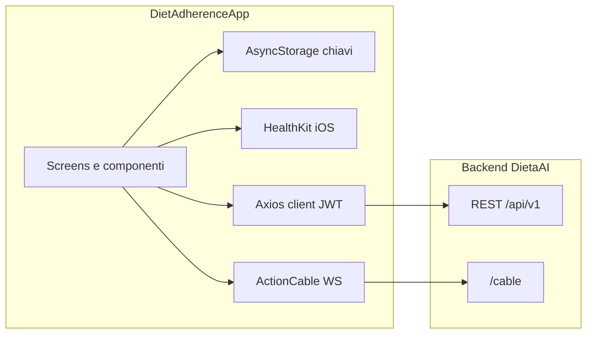

# Assessment — Struttura DietAdherenceApp e persistenza dati

Valutazione del repository **DietAdherenceApp** (app **React Native**): organizzazione del codice, **funzionalità prodotto** per l’utente, navigazione, persistenza dati, endpoint API e tabelle PostgreSQL sul backend Rails (repo separato).

---

## Questo repository: l’app React Native

Questa cartella **è** il progetto React Native. Non è il backend Rails: il server API è un altro repo (vedi sezione [Backend](#backend-tabelle-postgresql)).

### Stack e versioni

| Voce | Valore |
|------|--------|
| Framework | **React Native** `0.84.1` (`package.json`) |
| React | `19.2.x` |
| Entry JS | `index.js` → registra il componente root |
| Root component | `App.tsx` — `GestureHandlerRootView`, `SafeAreaProvider`, `QueryClientProvider`, `AuthProvider`, `ThemeProvider`, `NavigationContainer`, `RootNavigator` |
| Navigazione | `@react-navigation/native` + **drawer** + **native stack** (`src/navigation/`) |
| Bundler | Metro (`metro.config.js`) |

### Cartelle native (iOS / Android)

| Percorso | Contenuto |
|----------|-----------|
| `ios/` | Progetto Xcode, `Podfile`, `Info.plist`, entitlements (es. HealthKit), icone |
| `android/` | Gradle, `AndroidManifest`, risorse, launcher |

Comandi tipici: `npm start` / `yarn start` (Metro), `yarn ios` / `yarn android` (vedi `package.json`).

### Dipendenze rilevanti per l’app

- **Rete e stato:** `axios`, `@tanstack/react-query`
- **Chat real-time:** `@kesha-antonov/react-native-action-cable` (WebSocket verso `/cable`)
- **Auth locale:** `@react-native-async-storage/async-storage`
- **Salute iOS:** `@kingstinct/react-native-healthkit`
- **UI / navigazione:** `react-native-screens`, `react-native-safe-area-context`, `react-native-gesture-handler`, `react-native-reanimated`, `react-native-vector-icons`
- **Media:** `react-native-image-picker`

### Flusso navigazione (alto livello)

Definito in `src/navigation/RootNavigator.tsx` e `MainDrawerNavigator.tsx`:

1. **Non autenticato:** stack **Auth** → `LoginScreen`, `RegisterScreen`.
2. **Autenticato:** stack **App** → `OnboardingChatScreen` (primo accesso) oppure **`MainDrawerNavigator`**.
3. **Drawer principale** (`MainDrawerNavigator`): voci menu mappate su schermate:
   - `Chat` → `ChatScreen`
   - `ChatDemos` → `ChatDemosScreen` (anche dev)
   - `Today` → `HomeScreen`
   - `Foto` → `FotoScreen`
   - `Profilo` → `ProfiloStackNavigator` (`ProfiloScreen` → `ConfiguraScreen`, stack `Dieta` → `DietScreen`)
   - `Salute` → `SaluteStackNavigator` (`HealthScreen` → `HealthMetricStoricoScreen`)

### Schermate (`src/screens/`)

| File | Ruolo |
|------|--------|
| `LoginScreen.tsx` / `RegisterScreen.tsx` | Accesso |
| `OnboardingChatScreen.tsx` | Onboarding guidato |
| `HomeScreen.tsx` | Home / “Today” |
| `ChatScreen.tsx` | Chat con coach AI |
| `ChatDemosScreen.tsx` | Demo UI chat |
| `FotoScreen.tsx` | Foto pasti |
| `ProfiloScreen.tsx` | Profilo utente |
| `ConfiguraScreen.tsx` | Impostazioni |
| `DietScreen.tsx` | Dieta (sotto stack Profilo) |
| `HealthScreen.tsx` | Riepilogo salute / HealthKit |
| `HealthMetricStoricoScreen.tsx` | Storico metriche salute |

### Altre cartelle `src/` (oltre a `screens/`)

| Area | Ruolo |
|------|--------|
| `src/api/` | Client HTTP e dominio API |
| `src/hooks/` | Logica chat (`useChat`, Action Cable) |
| `src/context/` | `AuthContext`, `ThemeContext` |
| `src/components/` | UI riutilizzabile + `chat/` |
| `src/services/` | Integrazione Apple HealthKit |
| `src/onboarding/` | Onboarding e storage flag |
| `src/config/` | `api.ts` (base URL, WebSocket), `chat.ts` |
| `src/theme/` | Colori e preferenza tema |
| `src/types/` | Tipi TypeScript |
| `__tests__/` | Test Jest |

**In questo repository non c’è un database SQL nell’app** (nessun SQLite, WatermelonDB, Realm). Lo schema relazionale è sul **server** (`API_BASE` in `src/config/api.ts`).

---

## Funzionalità prodotto

Elenco orientato all’utente finale (da codice e schermate). Alcune funzioni dipendono dal backend (es. generazione AI) o da iOS per HealthKit.

### Accesso e account

- **Registrazione** e **login** con email e password; sessione con **JWT** persistito in locale.
- **Logout** (invalidazione sessione lato API dove previsto + pulizia token).

### Onboarding

- Flusso **chat guidata** al primo utilizzo (`OnboardingChatScreen`): passi configurabili da API (`/onboarding`), chip di menu, invio messaggi al backend per avanzare.
- Raccolta dati profilo (es. età, altezza, obiettivo peso) con aggiornamento profilo e creazione peso iniziale dove applicabile.
- Flag **onboarding completato** in AsyncStorage; fallback se il profilo risulta già completo da server.

### Home (“Today”)

- **Dashboard giornaliera** (`GET /dashboard`): saluto, data, riepilogo **piano del giorno** (kcal, macro P/C/G se disponibili).
- **Peso**: visualizzazione peso corrente / obiettivo / kg persi; **inserimento peso** con modale (salvataggio via API pesi).
- **Pasti di oggi**: carosello orizzontale con pasti dal piano (nome, ingredienti, kcal, macro); messaggio se non c’è piano caricato.
- **Ricette alternative** (“stessi macro”): lista orizzontale da API, card con ingredienti e macro; **Mi piace** registra la preferenza come **memoria** lato server (`RecipeLikeButton` / API memorie).
- **Suggerimento del giorno** testuale dal briefing incluso nella dashboard.
- **Pull-to-refresh** per aggiornare i dati.

### Chat con coach AI

- Messaggi **utente / assistente** con rendering **Markdown**; supporto **card strutturate** dal backend:
  - riepilogo **macro** (`macro_summary`);
  - **progresso pasti** (`meal_progress`);
  - **conferma peso** (`weight_confirm`) con invio conferma al server;
  - **ricetta alternativa** (`recipe_alternative`).
- Invio messaggi con possibile allegato **snapshot Apple Health** (se collegato e autorizzato).
- **Storico chat** con caricamento iniziale, **caricamento messaggi più vecchi**, refresh.
- **Indicatori di digitazione** e aggiornamenti in tempo reale via **Action Cable** (WebSocket).
- **Quick chips** (suggerimenti rapidi) dal briefing / contesto.
- **Reazioni** ai messaggi (like / dislike) con picker.
- Preferenza **chiusura automatica tastiera** dopo l’invio (Configura).
- Navigazione con **parametri** (es. prompt iniziale, auto-invio) da altre schermate.

### Dieta (“La mia dieta”)

- Visualizzazione **piano attivo** e **piani archiviati**; dettaglio per giorno della settimana (pasti, macro).
- **Creazione nuovo piano**: incolla **testo** del piano oppure **scansione AI** da **immagine** (galleria) che estrae testo.
- **Eliminazione** piano attivo e **riattivazione** di un piano precedente.
- **Indicatore piano attivo** / stato.

### Foto pasti

- **Galleria foto** caricate con data e indicazioni peso/progresso se presenti.
- **Caricamento** nuova foto dalla galleria; **eliminazione** foto.
- Commento / analisi **AI** associata alla foto quando fornita dal backend.
- Indicatori di **aderenza** / progresso se inclusi nella risposta API.

### Profilo

- **Intestazione** con nome e riepilogo (peso, obiettivo) da profilo/dashboard.
- **La mia dieta** → navigazione allo stack dieta.
- **Dati personali**: modale per modificare **nome**, **intolleranze** e altri campi profilo (`PATCH /profile`).
- **Storico pesate**: lista pesi da API con possibilità di **eliminare** una registrazione.
- **Configura** → tema e chat.
- **Logout** e **versione app** (`react-native-device-info`).

### Configura

- **Tema**: chiaro, scuro o **seguire il sistema** (persistito in AsyncStorage).
- **Chat**: opzione **chiudi tastiera dopo invio** messaggio.

### Salute (principalmente iOS)

- **Collegamento Apple Health** / richiesta autorizzazioni lettura dati.
- **Riepilogo** passi, energia attiva, peso, frequenze cardiache, sonno, grasso corporeo, BMI, SpO₂, distanza, scale, energia basale, kcal assunte, ecc. (in base a permessi e disponibilità HealthKit).
- Navigazione a **storico per metrica** (`HealthMetricStoricoScreen`) con serie temporali da HealthKit.
- **Refresh** manuale; link alle impostazioni sistema se serve.

### Funzioni solo sviluppo (`__DEV__`)

- Voci drawer extra: **Onboarding** (riapri flusso), **Chat demos** (card di esempio + chat vuota per test UI).

---

## Riepilogo cartelle `src/` (logica non-UI)

*(Schermate e navigazione: sezione precedente.)*

| Area | Ruolo |
|------|--------|
| `src/screens/` | Schermate (Home, Chat, Salute, Dieta, Profilo, Login/Register, onboarding, ecc.) |
| `src/api/` | Chiamate HTTP per dominio: auth, profilo, dashboard, dieta, chat, foto, pesi, ricette, onboarding, memorie |
| `src/hooks/` | Logica chat: storico, paginazione, cable, invio messaggi |
| `src/context/` | `AuthContext`, `ThemeContext` |
| `src/components/` | UI riutilizzabile + sottocartella `chat/` |
| `src/services/` | Integrazione **Apple HealthKit** (`appleHealth.ts`) |
| `src/onboarding/` | Flusso onboarding e flag completamento in AsyncStorage |
| `src/types/` | Tipi TypeScript condivisi (`index.ts`, `chat.ts`) |
| `__tests__/` | Test Jest |

### Architettura dati lato client (semplificata)

---

## Dove si registrano i dati (nell’app)

### 1. Backend remoto (persistenza principale)

| Dominio | File | Endpoint principali |
|---------|------|---------------------|
| Auth | `src/api/auth.ts` | `POST` login/register, `DELETE` logout |
| Profilo | `src/api/profile.ts` | `GET`/`PATCH` `/profile` |
| Dashboard | `src/api/dashboard.ts` | `GET` `/dashboard` |
| Piano dieta | `src/api/dietPlan.ts` | `GET` `/diet_plan`, `/diet_plans`; `POST` `/diet_plan`, `/diet_plan/scan`; `PATCH` reactivate; `DELETE` |
| Chat | `src/api/chat.ts` | `POST` `/chat`; `GET` `/chat/history`; `POST` `/chat/reaction`, `/chat/confirm`; `GET` `/chat/briefing` |
| Onboarding | `src/api/onboarding.ts` | `GET`/`POST` `/onboarding` |
| Memorie | `src/api/memories.ts` | `GET` `/memories` |
| Foto | `src/api/photos.ts` | `GET` `/photos`, `DELETE` `/photos/:id` |
| Pesi (storico API) | `src/api/weights.ts` | `GET` `/weights`, `DELETE` `/weights/:id` |
| Ricette | `src/api/recipes.ts` | `GET` `/recipes/alternatives` |
| Health check | `src/api/health.ts` | `GET` `/health` |

### 2. AsyncStorage (chiavi, non tabelle)

| Chiave / prefisso | Uso |
|-------------------|-----|
| `dietaai_jwt` | Token JWT (`src/api/authStorage.ts`) |
| `dietaai_onboarding_done_v1:` + userKey | Onboarding completato (`src/onboarding/onboardingStorage.ts`) |
| `theme_preference` | Tema (`src/theme/themePreference.ts`) |
| `chat_keyboard_auto_close` | Preferenza tastiera chat (`src/chat/keyboardPreference.ts`) |
| `apple_health_linked`, `apple_health_read_auth_prompted_v2` | Stato collegamento Salute (`src/services/appleHealth.ts`) |

### 3. Apple Health (iOS)

Dati letti da **HealthKit** sul dispositivo; possono essere inviati al backend come `health_data` con i messaggi chat.

---

## Backend: tabelle PostgreSQL

Schema di riferimento nel repo backend (cartella sorella dell’app, stesso workspace):

**Percorso:** `../backend/dietaai/db/schema.rb`  
**Versione schema (riferimento):** `2026_03_28_120000`  
**Estensioni:** `plpgsql`, `pgcrypto`, `vector` (pgvector per embedding memorie).

| Tabella | Contenuto |
|---------|------------|
| **users** | Account: email, password cifrata, nome, `birth_date`, `onboarding_completed`, `jti` (JWT), beta/testflight, `measurements_last`, ecc. |
| **users_targets** | Altezza e peso obiettivo (1 riga per utente) |
| **diet_plans** | Piani dieta (`raw_content`, `parsed_json`, flag `active`) |
| **conversations** | Messaggi chat (`role`: user / assistant / system_log, `content`, `metadata`) |
| **message_reactions** | Reazioni ai messaggi (FK verso `conversations`) |
| **memories** | Memorie long-term con embedding vettoriale (ricerca semantica) |
| **photos** | Foto caricate (`image_url`, `analysis`) |
| **recipe_alternatives** | Alternative ricette generate per tipo pasto e giorno |
| **meal_logs** | Log pasti (giorno, nome pasto, kcal, completato) |
| **current_user_health** | Snapshot salute corrente: peso, vita, % grasso, JSON snapshot |
| **biometric_events** | Storico eventi biometrici (tipo metrica, valore, meta, correzioni) |
| **goal_phase_logs** | Fasi obiettivo nel tempo (date, fase, peso target) |
| **onboarding_configs** | Configurazione flussi onboarding (`key`, `steps` JSON) |

**Nota:** la vecchia tabella `weights` è stata rimossa in favore di `current_user_health` e `biometric_events`; l’endpoint `/weights` lato API può mappare su queste strutture — verificare i controller Rails se serve il dettaglio.

---

## Sintesi assessment

| Aspetto | Esito |
|---------|--------|
| Tipo progetto | React Native 0.84, TypeScript, navigazione drawer + stack |
| Ambito prodotto | Dieta, chat AI, dashboard giornaliera, foto pasti, profilo, integrazione salute iOS |
| Persistenza dominio | Backend REST + WebSocket; nessun DB SQL in-app |
| Persistenza locale | AsyncStorage (token, preferenze, flag onboarding, Salute) |
| Dati sanitari iOS | HealthKit (`src/services/appleHealth.ts`) |
| Schema relazionale | PostgreSQL nel repo `backend/dietaai` |

## Punti di forza e limiti

**Punti di forza**

- Separazione API / schermate / navigazione / servizi nativi.
- Client Axios centralizzato con JWT e gestione 401/503.
- Tipi TypeScript per risposte normalizzate dove serve.

**Limiti**

- Nessuna cache offline strutturata (es. SQLite) per i dati di dominio: senza rete le schermate dipendono dall’API.
- Per colonne o vincoli aggiornati, la fonte autorevole resta `backend/dietaai/db/schema.rb` e le migrazioni in `db/migrate/`.
